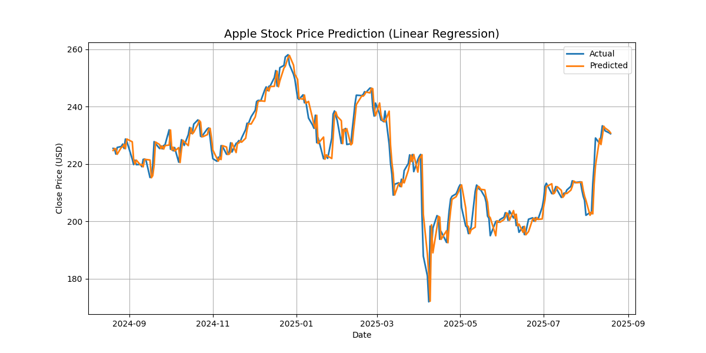

# uneeq-interns-AI-task2-Stock-Prediction
UneeQ Interns | Task 02 - Stock Market Prediction using Apple (AAPL) data and Linear Regression.

## 📌 Task Objective
Predict Apple (AAPL) stock prices using machine learning (Linear Regression) based on past closing prices.

## ⚙️ Tools & Libraries
- Python
- yfinance
- pandas
- scikit-learn
- matplotlib

## 📊 Model & Results
- Model: Linear Regression with lag features (previous 3 days’ closing prices).
- Performance:
  - MAE: 2.76
  - RMSE: 4.19
  - R²: 0.93

## 📈 Visualization


## ▶️ How to Run
1. Install requirements:
   ```bash
   pip install yfinance scikit-learn matplotlib pandas

